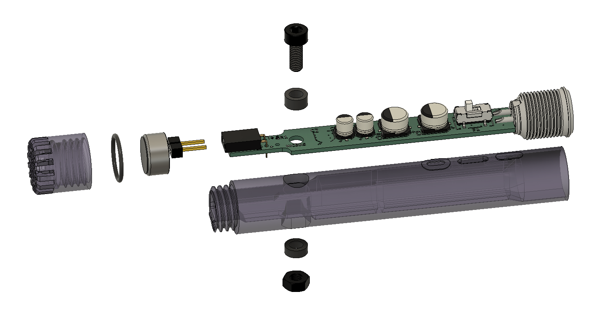
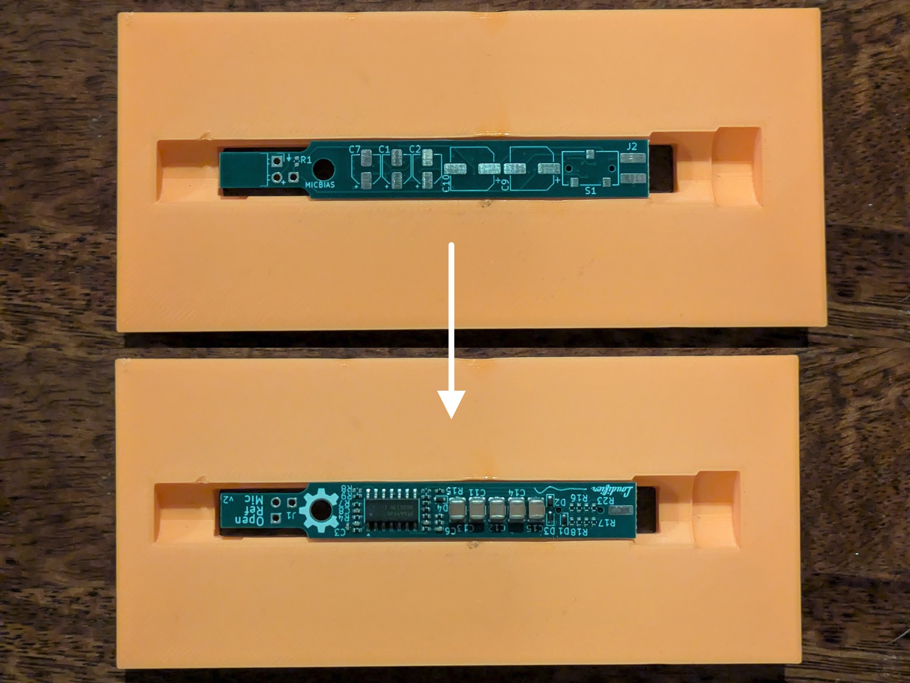
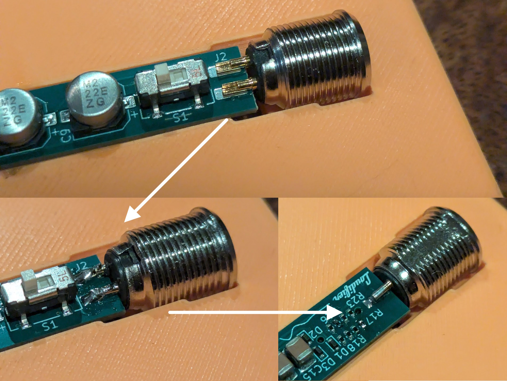
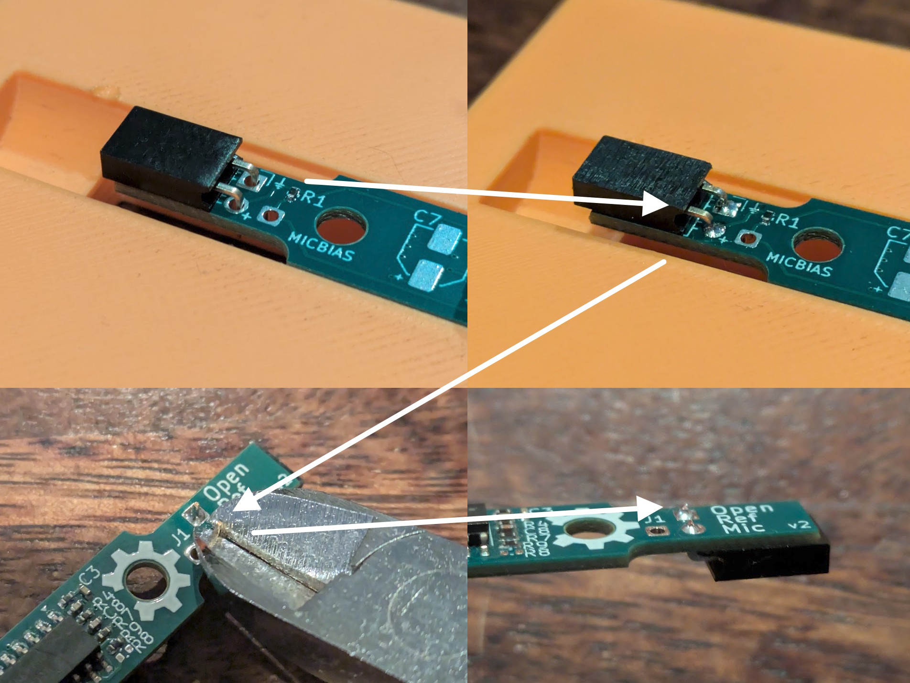
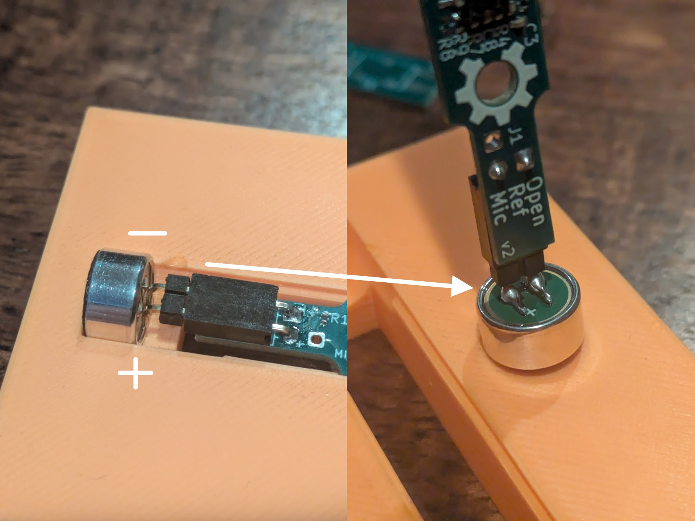
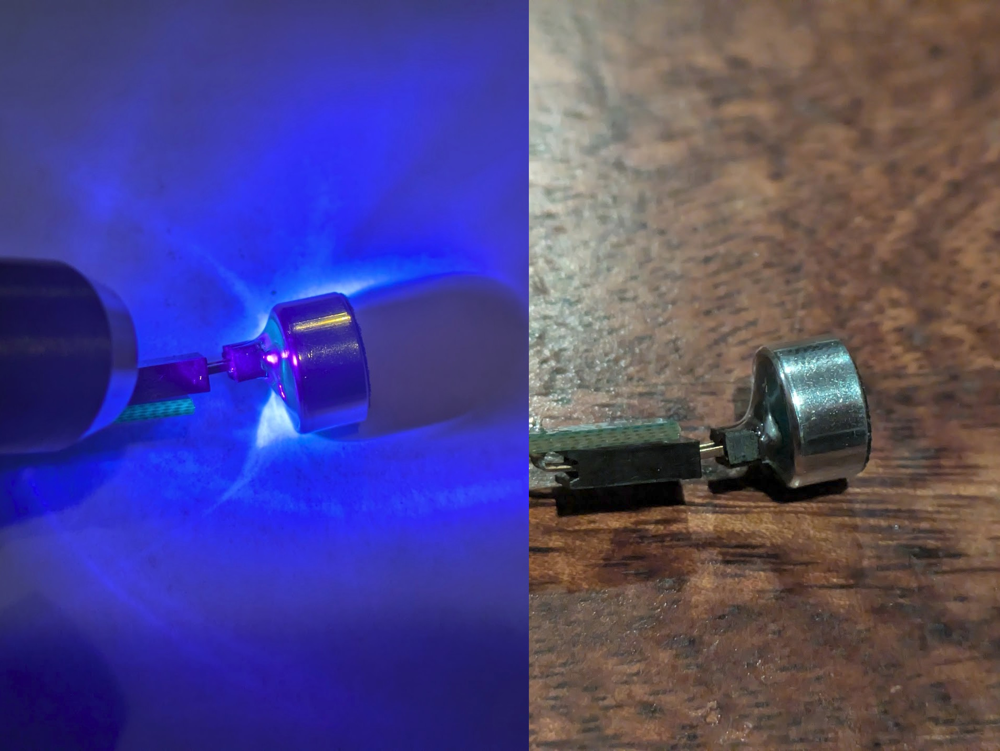
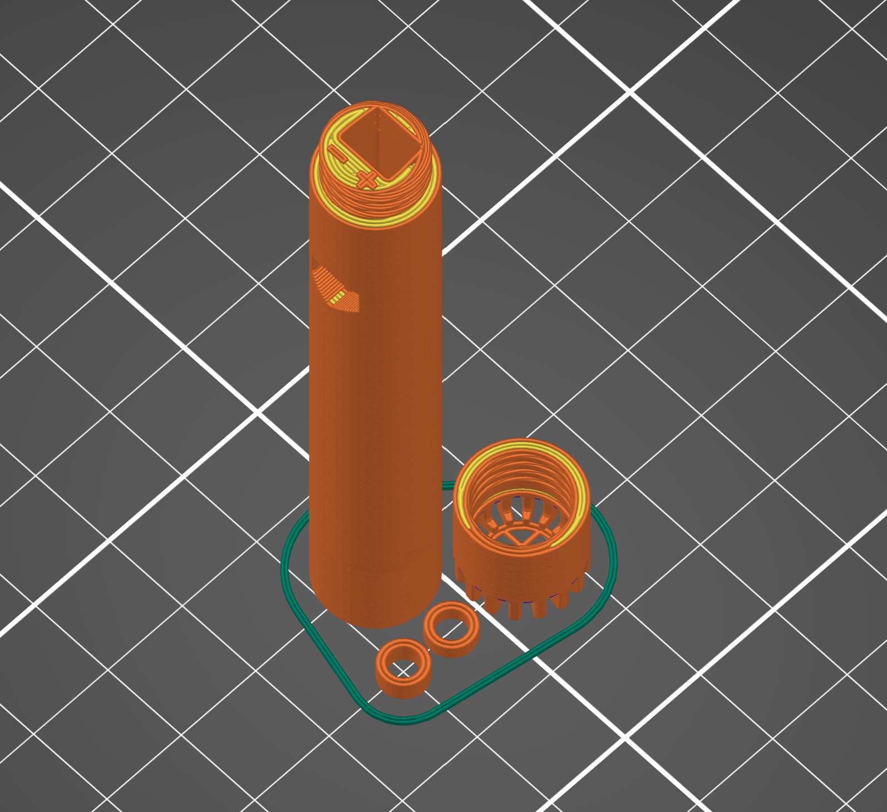
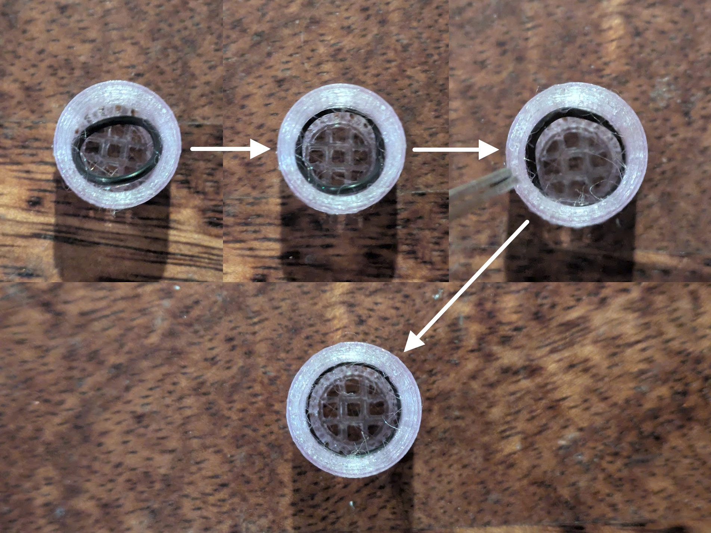
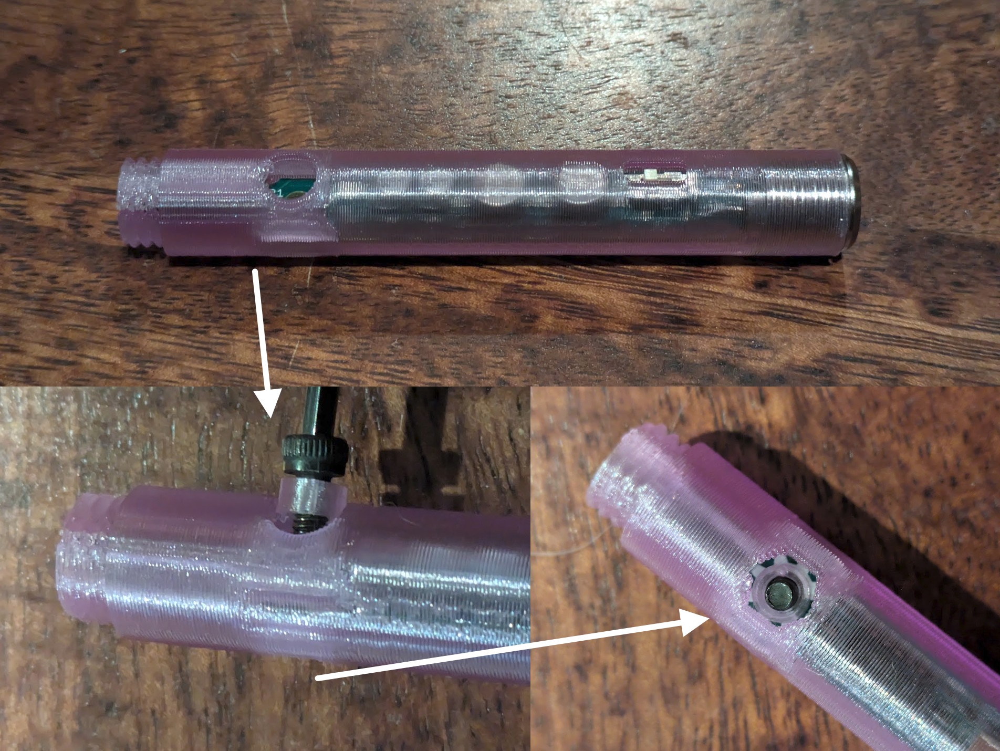
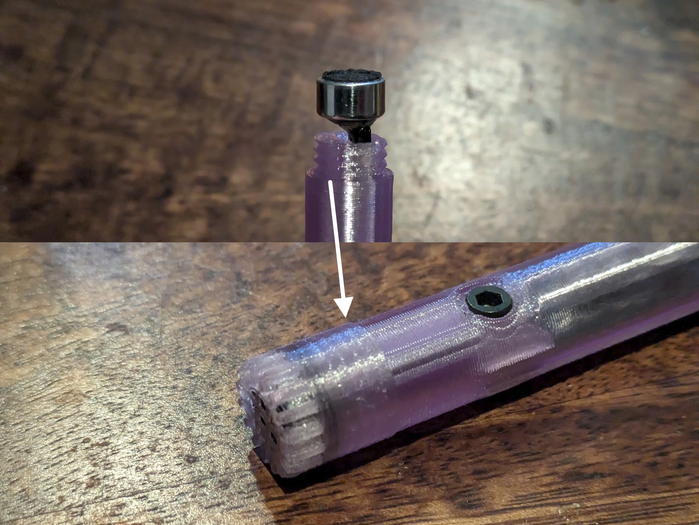

# Construction

The OpenRefMic design consists of an electret microphone capsule, preamplifier PCB, a single screw and nut, an O-ring, glue, and a few 3D printed parts designed to be printed on a regular consumer 3D printer.

## CAD files

STLs for the printed parts are [here](stl/). If you want to modify the design or adjust tolerances for printing, the Fusion360 design file is [here](OpenRefMic_v2.f3d), and a generic STEP file of the complete OpenRefMic assembly is [here](OpenRefMic_v2.step)

 

## Assembly Guide

There is a [soldering jig](stl/solder-jig.stl) included with the stl files that holds the PCB, mini XLR connector, and mic capsule in the correct position for soldering. It can also be helpful for the initial PCB assembly. It isn't strictly required, but is strongly recommended, particularly when attaching pins to the mic capsule.

### 1. Assemble the PCB

Starting with a bare PCB and components, install all of the components on the PCB except for the mini XLR connector and female header. [The interactive BOM](../preamplifier/OpenRefMic_v2-interactive_BOM.html) can be very helpful for this process.

 

### 2. Install the mini XLR connector

Seat the PCB in the soldering jig with the electrolytic caps and switch facing up, and place the mini XLR connector in the jig with the flat spot facing down. Push the PCB all the way in between the pins of the connector, make sure the pins are centered on the pads, and solder the pins to the pads on the PCB. Then flip the board over and solder the third connector pin to the pad on the bottom of the PCB.

 

### 3. Install the female header

Install the female header on the same side of the PCB as the electrolytic caps and switch. Solder the pins in place, then flip the board over and trim any excess length off the pins.

 

### 4. Add pins to the mic capsule

Insert the right angle male header pins into the female header with the angled pins pointing down. Place the mic capsule in the soldering jig and align the pads with the header pins. Make sure the mic polatity matches the markings on the PCB. Push the PCB and header pins all the way up to the pads on the mic capsule, then solder the pins to the capsule.

 

### 5. Reinforce capsule pins

If you plan on not sealing the mic capsule to the grille then this step is not strictly necessary, but it is still recommended to minimize the risk of the pads on the back of the capsule getting ripped off if you take the mic apart for repairs. Adding enough glue to the back of the mic capsule to encapsulate the solder joints adds significant strength to the connection between the pins and the capsule body.

Viscous (sometimes called "gel") super glue/cyanoacrylate can work, but tends to off gas in a way that can leave a residue on nearby surfaces, including potentially clogging up the openings on the mesh covering the front of the mic capsule. UV glue is recommended because it is similarly easy to work with, cures instantly, and usually gives off very few fumes. Add drops of glue on the back of the mic capsule around the solder joints and build it up in layers. The glue should form a taper from the back of the mic capsule up to the plastic part of the header pins. Be careful to not to get glue on the outer edge of the capsule, or it won't fit properly inside the grille.

### 6. Print the mic body, grille, and spacers

A filament and print settings that result in strong layer bonding are recommended for best results. The prototype microphone parts were printed on a stock Prusa MK3 printer with no supports, regular PETG filament, 0.15mm layer height, and the number of perimeters increased for effectively 100% concentric infill. You may need to adjust some print settings or tolerances in the CAD files so the parts fit together well. [print settings.3mf](stl/print%20settings.3mf) is a PrusaSlicer project file containing all of the 3D printed components and the print settings used to build the v2 prototypes.

The small features on the grille may result in stringing. As long as the grille threads properly onto the body, strings won't interfere with assembly or performance.

If you are using an alternate preamp filter configuration that doesn't use the switch, as described in the preamplifier section, there is a [version of the mic body with no hole or markings](stl/Body_no_switch.stl).

### 7. Install an O-ring in the grille

This step is optional. Sealing the mic capsule has almost no effect on the free field microphone response, but it does have a few small benefits. It ensures there is no air path around the mic capsule inside the body of the microphone, and keeps the grille from getting loose and needing to be tightened. A seal is required if you want to calibrate the microphone sensitivty using a pistonphone (or use it for any other pressure field application). Using an O-ring to seal the mic capsule results in significant twisting force on the soldered pins on the back of the capsule, so the pins must be reinforced with glue or the pads will be ripped off the capsule.

Using a pair of tweezers, insert one side of the O-ring into the grille. Get one part of the O-ring into the groove in the grille between the openings on the front of the grille and the threaded portion, then work from there around the edge inserting more of the O-ring until the entire O-ring seats into the groove.

### 8. Final assembly

Insert the PCB into the mic body. It should only fit in one orientation and should have very little resistance the entire way until the flange on the mini XLR connector is seated on the back of the mic body. Insert the M3x8 screw through the top (thicker) spacer and insert the screw into the round hole in the mic body, through the hole in the PCB. Insert the bottom (thinner) spacer into the hexagonal hole in the mic body, around the screw, then insert the M3 hex nut and tighten the screw.

Insert the mic capsule pins into the opening in the front of the mic body. There are polarity markings modeled into the front face of the mic body, and (assuming you used the soldering jig to add the pins to the capsule) the capsule should be concentric with the mic body. Thread the grille around the capsule and onto the mic body and gently screw the grille in. If you are using an O-ring for sealing there will be a lot of resistance. If you are not using an O-ring there should be very little resistance. If you are not using an O-ring and you have not reinforced the mic capsule pins, any resistance could be pressure on the side of the mic capsule, with a very high risk of ripping the solder pads off the back of the capsule. Depending on print/assembly tolerances, the grille may not thread all the way onto the mic body, leaving a very small gap between the grille and the mic body.

 

## Mini-XLR adapter

The last piece of assembly is an adapter to connect the mini-XLR OpenRefMic to a standard XLR input. Commercial adapters are available, but are difficult to find and expensive. Creating your own adapter is as simple as removing the full size female XLR connector from a standard microphone cable and replacing it with a female mini-XLR connector (one option is listed in the [BOM](../Bill_of_materials.csv)).

A standard microphone cable will probably not fit through the narrow opening of the plastic shroud on the mini-XLR connector, but the shroud can be easily drilled out to widen the opening enough to fit the larger cable through. The conductors will also probably be thicker than intended for the mini-XLR solder tabs, so be sure to shield the wires from each other with heat shrink or tape.
