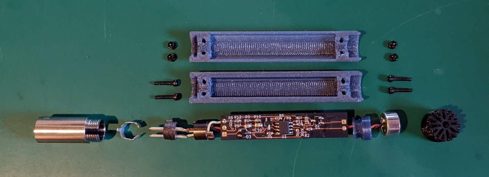
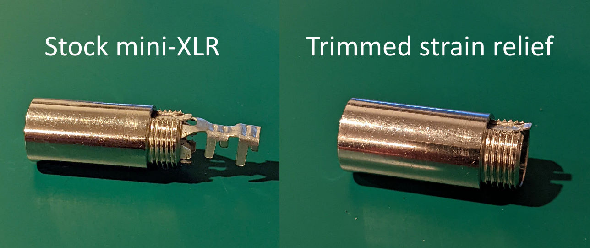

# Construction

The majority of the OpenRefMic structure is designed to be 3D printed on a consumer grade FDM printer. Parts for the prototype were printed on a stock Prusa i3 MK3S, with the body and coupler printed in PETG and the front grille printed in a generic TPU. Builders may need to adjust some print settings or tolerances in the CAD files so their parts fit together well.

 

## CAD files

STLs for the printed parts are [here](stl/). If you want to modify the design or adjust tolerances for printing, the Fusion360 design file is [here](ref-mic.f3d), and a generic STEP file of the complete OpenRefMic assembly is [here](ref-mic.step)

 

## Construction Guide

### Trim the mini-XLR strain relief

The mini-XLR connector is intended to terminate a cable, so it has a plastic shroud and crimping tabs to provide cable strain relief. Discard the plastic shroud. The strain relief structure is important for holding the solder tabs and XLR pins in place within the barrel of the connector, but it also extends past the threaded steel portion of the connector body, so it needs to be trimmed to mate properly with the microphone body.

Separate all of the pieces of the mini-XLR connector and use a pair of heavy clippers to cut all but the smallest tabs off of the strain relief part.

Reassemble the mini-XLR connector and check that the pieces all still line up and fit correctly after trimming. It should look like this when you are done.

 

### Print the mic body, coupler, and grille

The 3D printed structures are all small enough that they will likely be printed solid, regardless of your infill, layers, and perimeter settings. The prototype was printed with 0.15mm layer heights, but you may find that different or adaptive layer heights yield better quality with your printer.

Depending on your first layer calibration, you may want to reduce the elephant's foot compensation in your slicer settings for the mic body pieces. Setting the elephant's foot compensation to 0.1mm in Prusa Slicer improved the first layers for the prototype, particularly the long, thin walls of the top mic body piece.

The mating features on the coupler are thin, so you may want to print multiple copies at once to force longer layer times and sufficient cooling.

TPU is often stringy, and the features on the grille are very fine, so there will likely be threads between the openings in the grille. You can try to clean these up with a sharp knife to make it look better, but they should be small enough that they will not have any acoustic impact.

<!--TODO: photo of grille (with strings)-->

If you can't print or source TPU for the grille you may be able to print the grille in a rigid material, but you will need to adjust the inner diameter to ensure the microphone capsule can fit inside the grille. You will also need to glue or otherwise seal around the edges of the capsule, or risk strange responses due to leakage into the mic body.

 

### Check for fit

Verify that the mic capsule and front of the coupler can be press-fit into the grille, but be careful not to insert the mic too far, or you may have trouble getting it back out without damaging the grille and needing to print another copy.

Verify that the hexagonal mating feature of the coupler fits into the slots on the top and bottom mic body pieces, and that the coupler is held firmly in place when the body pieces are closed together. If it is too loose, then you may want to reduce the clearance between the coupler and mic body, or you can add a dab of glue between the parts during final assembly.

Check for fit between the trimmed mini-XLR connector and the printed threads of the mic body, aligning the tab in the connector with the slot in the top mic body part. The threads in the mic body halves are modeled with an extra 0.05mm clearance, which creates a snug fit with the mini-XLR connector in the prototype. You may need to adjust this clearance, depending on your print tolerances.

The top and bottom pieces of the mic body are modeled with a 0.15mm gap between them. This gap is aligned with the print layer lines, and creates and almost invisible parting line in the prototype mic. You can reduce the gap to minimize the appearance of the parting line, but a small gap helps ensure the halves of the mic body solidly clamp the mini-XLR connector and coupler

 

### Assemble the PCB

Depending on your PCB supplier, you may need to trim the edges of the PCB. The prototype boards were ordered from OSHPark, and had large tabs that needed to be trimmed for the PCB to fit in the bottom body piece.

Make sure the electrolytic capacitors are as close to centered on the PCB as you can get them. There is some tolerance in the PCB to mic body design, but keeping the caps centered is the most important part.

<!--TODO: photo of assembled PCB-->

 

### Attach the mic and connector

Solder wires onto the pads on the back of the microphone capsule, and trim the wires to about 15mm. You want enough length to reach the PCB, but not so much that it will be dfficult to squeeze the slack into the coupler cavity.

Thread the mic wires through the coupler, and solder them to the mic pads on the PCB. Pin 1 (the square pin) is ground!

Take apart the mini-XLR connector so you can actually reach the solder tabs with an iron. Solder wires to the pins, reassembly the connector, and trim the wires just like with the mic capsule.

Carefully verify the XLR pinout before soldering the connector wires to the PCB! Most full-size XLR connectors will have numbers next to the pins, so use a regular male XLR connector as your reference. You should probably also check the continuity between the pads on the PCB and whatever mini-XLR adapter you are using before applying phantom power.

<!--TODO: photo of PCB with mic and connector-->

 

### Final Assembly

Connect the microphone to your mic interface and apply phantom power to verify the preamp, mic capsule, and connector are working properly before final assembly, then disconnect everything again.

Insert the mic capsule into the grille, and use the coupler to push it all the way in. Insert the coupler behind the mic capsule, then slot the coupler into the mating feature in the bottom half of the mic body.

<!--TODO: photo of inserting mic into grille-->

Insert the PCB flat into the bottom half of the mic body, and align the mini-XLR connector with the threads as it would be if you screwed the connector in all the way.

<!--TODO: photo of bottom assembly, XLR aligned-->

Adjust the mic capsule and connector wires as needed to ensure they are not blocking the screw holes, and make sure the tab and slot on the connector are aligned face up, then close the top half of the mic body over the whole assembly. You may need to work it a little to make sure the connector tab is in the alignment slot and that the connector is inserted in the mic body as close as the threads will allow.

While holding everything together, insert the screws and nuts, and tighten everything up. The grille and connector should be held snugly in place, with very little gapping to the mic body.

<!--TODO: photo of gap-->

Connect the assembled ref mic to your microphone interface and verify that everything is working. Congratulations! Now, have fun taking measurements!

 

 

### Mini-XLR adapter

The last piece of assembly is an adapter to connect the mini-XLR OpenRefMic to a standard XLR input. Commercial adapters are available, but are difficult to find and expensive. Creating your own adapter is as simple as removing the full size female XLR connector from a standard microphone cable and replacing it with a female mini-XLR connector (one option is listed in the [BOM](../Bill_of_materials.csv)).

A standard microphone cable will probably not fit through the narrow opening of the plastic shroud on the mini-XLR connector, but the shroud can be easily drilled out to widen the opening enough to fit the larger cable through. The conductors will also probably be thicker than intended for the mini-XLR solder tabs, so be sure to shield the wires from each other with heat shrink or tape.

<!--TODO: photo of adapter with shroud pulled back-->