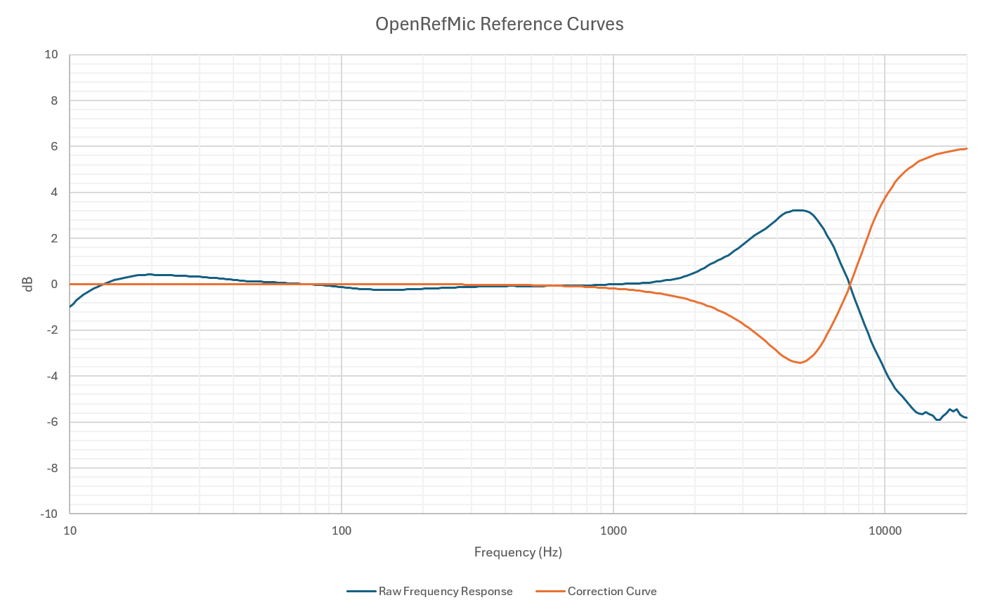

# Calibration

The PUI AOM-5024L-HD-F-R electret microphone element was selected for OpenRefMic primarily for its very high SNR, but it has poor frequency response flatness compared to most electret microphones. Within the constraints of the hardware available for comparison, a reasonable correction curve has been derived that can be applied to match the AOM-5024L-HD-F-R high frequency response to within ~2dB of the response of comparable prosumer measurement microphones. The OpenRefMic v2 PCB includes a filter that can be applied directly in the microphone, avoiding the need for post-processing.

 

## Typical Performance

Due to unit to unit variability between mic capsules (and to a lesser extent component tolerances in the preamp), OpenRefMic sensitivtity and noise floor can vary by up to ±3dB. The following values have been measured from a single OpenRefMic prototype and can be used as approximate levels that can be used to get reasonably close for other OpenRefMics

Sensitivity at 1kHz, 1Pa/94dBSPL
- -20.7dBV
- 92.2mV

 

Signal to Noise Ratio relative to 94dBSPL(A-weighted)
- 78.2dB SNR

 

Noise Floor (A-weighted)
- 15.8dBA
- -98.9dBV
- 11.35uV

 

## Calibration files

Calibration files are available in several formats:

- [frequency-response.csv](frequency-response.csv) - Raw frequency response at 94dBSPL (1Pa), calibrated against a Listen SCM-2 reference microphone, 24 points per octave from 10Hz-20kHz with no smoothing. The ripples above ~13kHz are artefacts of the measurement setup, and it is not recommended to actually use this data to correct any measurements or recordings. This data is provided for reference only.

 

- [correction-curve.csv](correction-curve.csv) - Amplitude adjustments to apply to measurements taken with an OpenRefMic, 24 points per octave from 10Hz to 20kHz. This curve was derived by using a Monte Carlo optimization to match 2nd order filters to the inverse of the microphone's high frequency response.
    - How you use this correction curve depends on what software you are using it with. You may be able to import it directly, or you may need to interpolate the frequency points to match your measurement points. If your software does not allow importing you may need to export raw measurment data at the same frequency resolution as the correction curve and apply the curve to the output with an external tool (e.g. Excel)
    - For frequency-amplitude measurements like frequency responses and noise sprectra, the correction curve should be summed with the raw measurment.
    - For equalization of recordings, you can import the correction curve into any FIR filter (or similar effect) that allows you to use arbitrary EQ curves.

 

- [second-order-filters.txt](second-order-filters.txt) - Parameters and coefficients for filters at different sample rates that you can use to equalize recordings taken with an OpenRefMic. Only two filter stages are needed to correct the frequency response up to 20kHz, a shelving filter to recover frequencies above ~7kHz and a moderate notch to reduce a resonance around 5kHz.
  - You can input the filter parameters into any tool that implements 2nd-order IIR filters. The names for these filters vary from tool to tool. They may be labeled "biquad", "scientific filters", "parametric EQ", "analog filters", etc. The exact implementation might be different, so you should verify the filter response is consistent with correction-curve.csv.
  - Due to frequency warping effects, the exact filter values are slightly different at each sample rate. The values were derived using a Monte Carlo optimization process.
  - Recordings can be equalized using the command-line audio processing tool [SoX](http://sox.sourceforge.net/). For a recording at 48kHz the command would be:
    `sox <raw recording> <equalized recording> treble 5.94 6180 1.313q equalizer 7314 1.149q -6.12`
