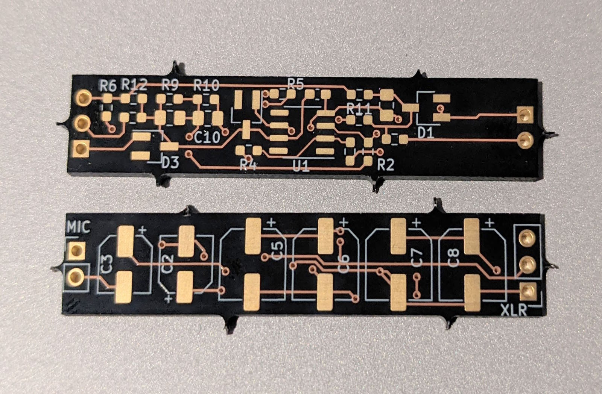
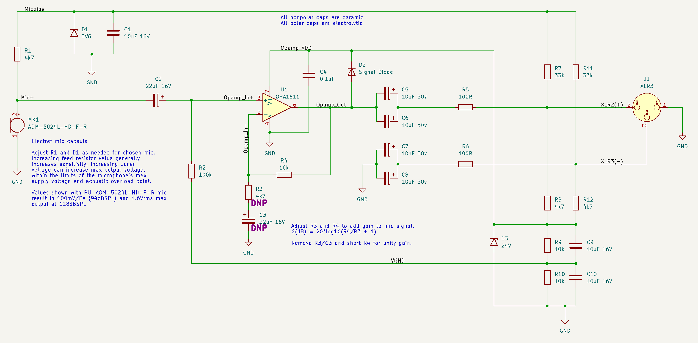

# Preamplifier

A high performance mic element determines the majority of the acoustic characteristics of a measurement microphone, but for the hobbyist or experimenter on a budget, actually powering and getting a useful signal from the mic element can be difficult. A power supply with low acoustic and electrical noise is required, as well as a data acquisistion system that can capture the full dynamic range of the transducer, particularly the lowest signal levels. Modern consumer or "pro audio" equipment (not to be confused with "professional" equipment for measuring products in development against telephony standards, etc.) is available with excellent performance and very affordable pricing, but cannot directly power an electret mic or get an optimal signal level from it.

The preamplifier is the heart of the OpenRefMic project, powering an electret microphone from a standard 48V phantom power supply and buffering the mic signal to drive a typical low impedance microphone input.

 

## Schematic, layout, project files

The preamplifier schematic in PDF format can be found [here](OpenRefMic-schematic.pdf), and the KiCAD project files and gerbers are [here](ref_mic/). The complete bill of materials (including a connector to make a mini-XLR adapter from a full size XLR cable and the cost of PCBs from OSHPark) is [here](OpenRefMic-schematic.pdf).

 

## Circuit description

Phantom power is supplied from the host microphone interface in the form of 48VDC connected to each signal line of the balanced cable via 6.81k resistors. The OpenRefMic preamplifier creates two power rails from the phantom power with simple Zener shunt voltage regulators, a 24V rail to power an opamp and a 5.6V bias voltage to power the electret microphone.

The opamp supply is fed from the phantom power supply through R8 and R12, with D3 regulating the shunt voltage, R9 and R10 creating a voltage divider for virtual ground, and C9 and C10 providing bulk capacitance and low AC impedance for the VGND. Few opamps have both low noise and low current consumption, but the OPA1611 has extremely low noise and low enough current consumption to run on phantom power (and can actually be purchased in small quantities in 2022). The ~3.6mA current draw is enough that the opamp supply voltage is only about 16V after resistive losses through the feed resistors, but the Zener is included in case a particularly low current opamp is used or the amp goes into a low-power shutdown mode of some sort.

The electret mic bias voltage is fed from the power supply through R7 and R11, with D1 and C1 regulating the shunt voltage.

Electret microphones use a single pin for power input and signal output. They are fairly tolerant of different bias voltages and feed resistances, but ~3V supplied through a 2.2k resistor is common. The feed resistor creates a voltage divider with the microphone's output impedance, so the sensitivity can be increased by increasing the feed resistance. The bias voltage determines the microphone's maximum peak to peak output voltage, so increasing the bias voltage can raise the effective acoustic overload point of the mic. The transducer itself will limit the absolute AOP, but increasing the bias voltage can provide some electrical headroom, particularly when increasing the feed resistance for higher sensitivity.

With 5.6V bias and 4.7k feed resistor, R1, the AOM-5024L-HD-F-R has a voltage sensitivity of about 1V/Pa and an AOP of 118dBSPL. This voltage range matches well with the dynamic range of most microphone inputs, and almost perfectly matches the dynamic range of the popular Focusrite Scarlett 2i2 mic input at the minimum gain setting.

An opamp is not strictly necessary to connect the output of an electret mic to a microphone input, but some sort of buffer is needed if you want to maintain a balanced output impedance and high rejection ratio for any common mode noise that is picked up in the cabling. Buffering the signal also avoids loading the electret mic output with the low impedance input of the microphone interface. Discrete buffers/amplifiers can be built with very good performance and low current consumption (and often with wider supply voltage tolerance), but an opamp requires less overall board area and is easier to implement with guaranteed performance.

U1 is configured as a noninverting buffer. C2 AC-couples the electret mic signal to the opamp input, and R2 provides DC bias. R4 can be shorted to maintain unity gain, or R3 and C3 can be populated to add gain to the electret mic signal. The values shown will add 10dB of gain, and R4 can be increased or R3 can be decreased for more gain, but R3 should not be less than 1k or you will get low frequency roll off.

C5 and C6 AC-couple the opamp output. 10uF is probably sufficient for most applications, but 20uF ensures flat frequency response below 10Hz with most microphone inputs. A single 22uF capacitor could be used, but any 22uF 50V cap that fits inside the 1/2" mic body would be prohibitively expensive, if it even exists.

R5 is standard for audio outputs that drive cables, and can help protect the opamp from short circuits or excessive cable capacitance, and C4 provides power supply decoupling for the opamp.

C7, C8, and R6 appear useless at first glance, but are present to match the impedance of the noninverting output. This is not true differential signaling, but it is technically balanced, often called pseudodifferential. As long as both noninverting and inverting signal lines are terminated with matched impedances, EMI picked up by the cable will be equal on both lines and will be canceled by the microphone input.

Finally, D2 protects the opamp when phantom power is initially applied. When all of the capacitors are discharged and phantom power is turned on it will briefly apply 48V to the opamp output, until the AC-coupling caps charge up. The diode instead shunts the voltage at the opamp output to the opamp supply rail, which increases from 0V up to its operating voltage when the supply caps are charged.