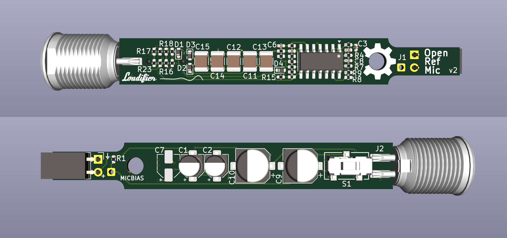
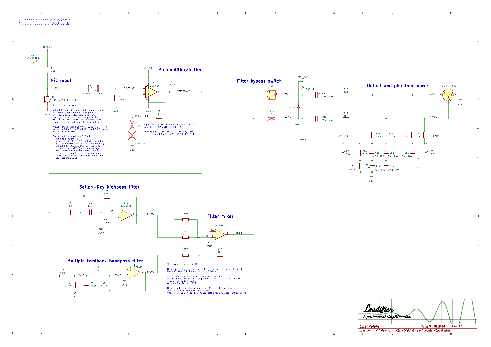
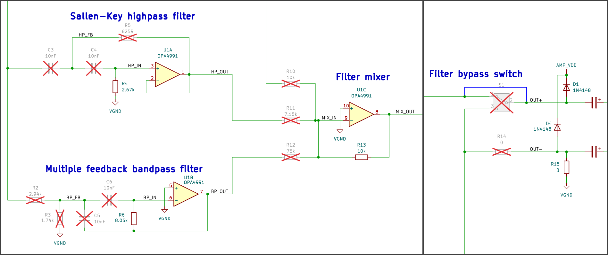
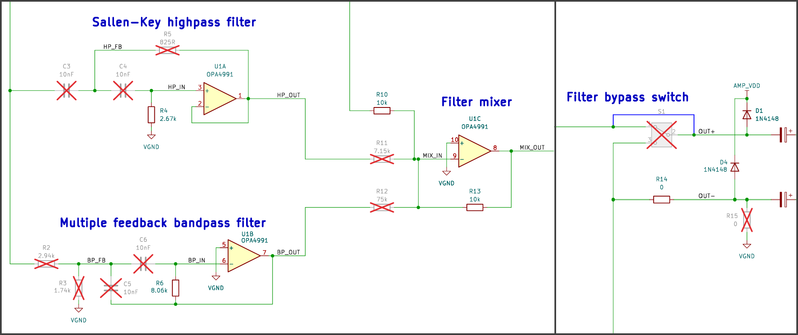
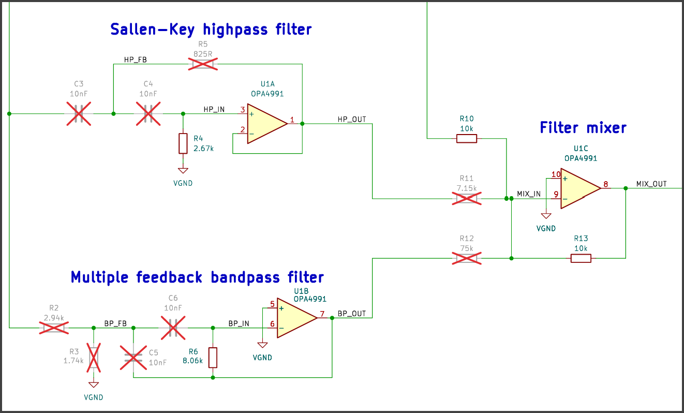
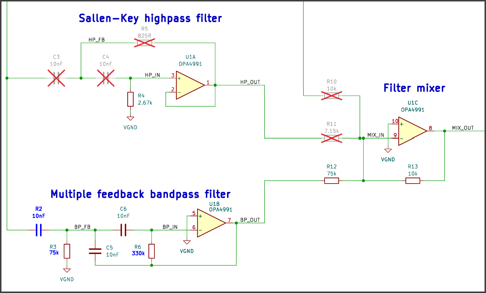

# Preamplifier

A high performance mic element determines the majority of the acoustic characteristics of a measurement microphone, but for the hobbyist or experimenter on a budget, actually powering and getting a useful signal from the mic element can be difficult. A power supply with low acoustic and electrical noise is required, as well as a data acquisistion system that can capture the full dynamic range of the transducer, particularly the lowest signal levels. Modern consumer or "pro audio" equipment (not to be confused with "professional" equipment for measuring products in development against telephony standards, etc.) is available with excellent performance and very affordable pricing, but cannot directly power an electret mic or get an optimal signal level from it.

The preamplifier is the heart of the OpenRefMic project, powering an electret microphone from a standard 48V phantom power supply, correcting the capsule frequency response, and buffering the mic signal to drive a typical low impedance microphone input.

 

## Schematic, layout, project files

The preamplifier schematic in PDF format can be found [here](OpenRefMic_v2-schematic.pdf), and the KiCAD project files and gerbers are [here](ref_mic/gerbers/). The complete bill of materials (including optional and mechanical parts) is [here](../Bill_of_materials.csv).

 

## Circuit description

### Power

Phantom power is supplied from the host microphone interface in the form of 48VDC connected to each signal line of the balanced cable via 6.81k resistors. The OpenRefMic preamplifier creates two power rails from the phantom power with simple Zener shunt voltage regulators.

The opamp power rail is fed from the phantom power supply through R18 and R19. The actual opamp supply voltage depends on the opamp current draw and the VGND voltage divider formed by R20 and R21, and C11-C14 provide bulk capacitance and low AC impedance for the VGND. OPA4991 is recommended for its low noise and low quiescent current, resulting in an opamp supply rail around 18V. When power is applied or in the event the opamp current draw is very low or missing, D2 clamps the opamp supply rail to 24V.

D1 and D4 protect the opamp when phantom power is initially applied. When all of the capacitors are discharged and phantom power is turned on it will briefly apply 48V to the opamp output, until the AC-coupling caps charge up. The diodes instead shunt the voltage at the opamp output to the opamp supply rail, which is shunted through D2.

The electret mic bias voltage is fed from the power supply through R22 and R23, with D3 and C15 regulating the shunt voltage.

Electret microphones use a single pin for power input and signal output. They are fairly tolerant of different bias voltages and feed resistances, but ~3V supplied through a 2.2k resistor is common. The feed resistor creates a voltage divider with the microphone's output impedance, so the sensitivity can be increased by increasing the feed resistance. The bias voltage determines the microphone's maximum peak to peak output voltage, so increasing the bias voltage can raise the effective acoustic overload point of the mic. The transducer itself will limit the absolute AOP, but increasing the bias voltage can provide some electrical headroom, particularly when increasing the feed resistance for higher sensitivity.

With 5.6V bias and 4.7k feed resistor, R1, the AOM-5024L-HD-F-R has a voltage sensitivity of about 1V/Pa and an AOP of 118dBSPL. This voltage range matches well with the dynamic range of most microphone inputs, and almost perfectly matches the dynamic range of the popular Focusrite Scarlett 2i2 mic input at the minimum gain setting.

### Buffer and balanced output

An opamp is not strictly necessary to connect the output of an electret mic to a microphone input, but some sort of buffer is needed if you want to maintain a balanced output impedance and high rejection ratio for any common mode noise that is picked up in the cabling. Buffering the signal also avoids loading the electret mic output with the low impedance input of the microphone interface.

U1D is configured as a unity gain buffer. C1 and C2 AC-couple the electret mic signal to the opamp input, and R7 provides DC bias. The mic bias supply and VGND bias may be around the same DC voltage, so C1 and C2 are arranged with opposing polarities to form a nonpolar cap. To increase the buffer gain, increase the value of R9 and populate R8 and C7. To avoid low frequency roll off, the value of R8 should not be reduced below 4.7k.

C9 AC-couples the opamp (or filter mixer) output. 22uF ensures flat frequency response below 10Hz with low impedance microphone interfaces. R16 provides some isolation from the opamp output and capacitive cable loads.

R15, C10, and R17 appear useless at first glance, but are present to match the impedance of the noninverting output. This is not true differential signaling, but it is technically balanced, often called pseudodifferential. As long as both noninverting and inverting signal lines are terminated with matched impedances, EMI picked up by the cable will be equal on both lines and will be canceled by the microphone input.

### Frequency response correction filters

The AOM-5024L-HD-F-R mic capsule has a very low noise floor, but deviates from a flat frequency response at higher frequencies. This response is consistent, and can be flattened out with a carefully arranged filter network. That correction can often be applied as a postprocessing step (see [calibration](../calibration/CALIBRATION.md)), but v2 of the OpenRefMic preamplifier includes an analog filter netowrk that can correct the response for situations where postprocessing is cumbersome or impossible.

The AOM-5024L-HD-F-R response has a resonant peak around 5.5kHz with an attenuated high shelf that flattens out above 14kHz. The high shelf response is corrected by summing a highpassed copy of the micropohne signal with the unfiltered micropohne signal. That leaves a notch that is then corrected by adding an additional bandpassed copy of the signal.

<!--TODO: add graphs for raw and corrected response and individual filters-->

The highpass response is realized with a Sallen-Key filter around U1A, and the bandpass response is formed by a multiple feedback bandpass filter around U1B. U1C acts as an inverting mixer, with R10-R13 adjusting the gain/mixing ratios of the filtered and unfiltered signals. This means the phase of the overall microphone response with frequency response correction is inverted, relative to the microphone capsule phase. This is usually easily corrected in hardware or software that expects microphone inputs for measurement, mixing, or recording.

The exact filter parameters and component values were arrived at through simulation, filter calulators, and an iterative optimization script to minimize deviations from a flat response in the filtered AOM-5024L-HD-F-R response.

S1 allows selection between the raw microphone signal and the microphone signal with frequency response correction applied.

## Alternate filter configurations

### No filter, true balanced output
If you are using the OpenRefMic preamplifier with a different mic capsule that does not need frequency response correction, you can eliminate the filter blocks and filter bypass switch.

- Remove S1, and jump S1 pads 1 and 2
- Most of the components around U1A, U1B, and U1C are not necessary, but R4, R6, and R13 should be populated to avoid unpredictable behaviour

To add an inverted signal for true balanced ouptut:

- Remove R11, R12, and R15
- Populate R10, R13, and R14

Note that the effective ouptut amplitude is 6dB higher with balanced output, so you may need to reduce the value of R1 and/or voltage of D3 to ensure sufficient headroom with your micropohne interface.

### Phase switch

If you need phase control more than frequency response correction, S1 can repurposed to select between noninverted and inverted output.

- Remove R11 and R12

### Rumble filter

For a switchable highpass filter to remove rumble below 100Hz:

- Remove R10 and R11
- Replace R6 with a 330k resistor
- Replace R3 with a 75k resistor
- Replace R2 with a 10nF capacitor
- Replace R12 with a 10k resistor

